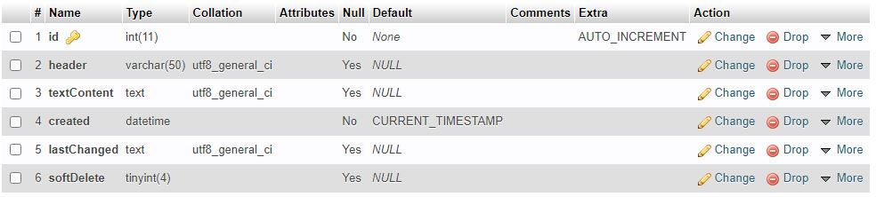

# NotesSystemApp

App that creates and saves dokuments that can be viewed and changed, then saved to a MySQL database through TinyMCE editor, it uses Node.js, Express and its fron-end is built in old fashioned Vanilla JS!

 

by Joel Hägg

#

 

# How to start

I run MAMP to start a MySQL server

- npm install
- nodemon start

 

# NPM packs used

- express
- nodemon
- mysql2
- cors
- bcrypt

#

 

# MySQL setup

 

 
 
